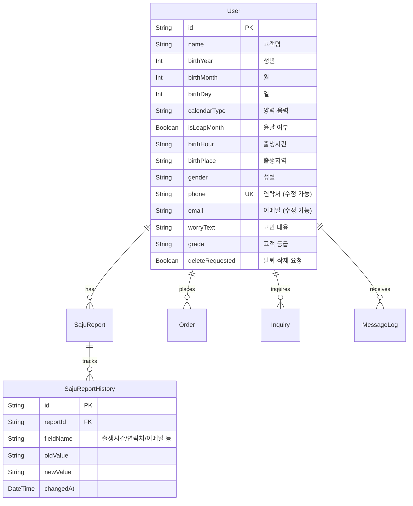

# 혜안당 통합 관리자(Admin) 시스템 최종 명세 기획서

본 문서는 혜안당 사주 플랫폼의 관리자가 플랫폼 전체의 상태를 한눈에 모니터링하고, 고객 정보 수정, 수동 메시지 재발송, 상품 정보, 통계 및 프로모션 내역을 통합 통제하기 위한 최종 요구사항 및 기능 명세서입니다.

---

## 1. 개요 및 디자인 컨셉
* **구동 방식**: Next.js 16 및 React 19 기반의 단일 페이지 어플리케이션(SPA) 어드민 뷰.
* **디자인 테마**: 럭셔리 다크 스톤 테마 (Luxury Dark Stone Theme). 깊이 있는 차콜 톤 배경에 황동색(Brass Gold, `#A3845B`)을 강조 포인트 컬러로 사용하여 혜안당 브랜드만의 정통적이고 고급스러운 느낌을 부여합니다.

---

## 2. 데이터베이스(DB) 매핑 구조 (SQLite + Prisma)
기획서의 모든 필드가 아래와 같이 스키마에 정의되어 구동됩니다.

---

## 3. 핵심 화면 탭(Tab)별 기능 상세 명세

### 📑 탭 1. 대시보드 (Dashboard)
* **주요 현황 집계**:
  - 오늘 신청 건수 / 결제 완료 건수
  - 보고서 생성 완료 건수 / 생성 실패 건수
  - 미결제 건수 / 환불 요청 건수 / 고객 문의 건수
  - 오늘 매출 / 이번 달 매출 / 고객 수정 요청 / 환불 요청
* **진행 상태 요약**:
  - 정보 입력 → 결제 대기 → 결제 완료 → 사주 분석 중 → 보고서 생성 완료 → 고객 전달 완료 파이프라인 진행률 시각화.

### 📑 탭 2. 상품 및 상품 구성 관리 (Product)
* **상품 목록 (9개 대분류)**:
  - 평생 종합사주, 신년운세, 토정비결 (각각 문자요약/고급/심화 리포트 구분 포함)
  - 재물&비즈니스운, 타로상담, 연인궁합, 궁합 (밀착궁합), 재회운, 꿈해몽&사주조율
* **상품 설정 세부 제어**:
  - 상품명, 판매가격, 할인가격, 상품 설명, 보고서 페이지 수
  - 보고서 목차 활성화 제어
  - 필요한 고객 입력정보 항목 정의
  - 결과 생성 방식 (AUTO / MANUAL), PDF 템플릿 파일 지정
  - 예상 생성시간 안내 문구, 판매 여부 및 노출 순서

### 📑 탭 3. 고객 관리 (Customer)
* **고객 목록 및 사주 정보**:
  - 고객 입력 정보 10종 필드 검색 및 상세 뷰.
* **[보완] 고객 연락처 및 이메일 수정**:
  - 관리자가 고객의 요청에 따라 **이메일 및 전화번호를 즉시 수정**할 수 있는 관리자 전용 수정 폼 제공.
* **고객정보 수정 이력 (Audit Trail)**:
  - 출생시간 변경, 음/양력 변경, 생년월일 오입력 교정, 이름 변경, **이메일 및 전화번호 수정 내역**이 시간 순서대로 타임라인 로그(`SajuReportHistory`)로 적재되어 상세 화면에 노출됨.

### 📑 탭 4. 주문 관리 (Order)
* **주문 목록 조회**:
  - 주문번호, 신청번호, 고객명, 상품명, 결제금액, 결제수단, 결제상태, 결제일, 보고서 상태, 환불상태.
* **결제 상태 필터**:
  - 결제 대기, 결제 완료, 결제 실패, 결제 취소, 부분 환불, 전체 환불, 입금 확인 대기.
* **관리자 수동 제어**:
  - 결제 내역 확인 / 무통장 입금 확인 / 현금영수증 발행 정보 확인
  - 환불 요청 승인 처리 / 주문 취소 / 결제 오류 및 중복 결제 확인
  - 결제 완료 후 보고서 수동 생성 토글
* **[보완] 주문 내용 및 보고서 확인 링크 수동 재발송**:
  - 고객이 보고서 문자/이메일을 받지 못했거나 분실했을 때, 관리자가 버튼 클릭 한 번으로 **알림 메시지(신청 접수, 결제 대기, 결제 완료, 보고서 확인 링크 등)를 고객의 전화번호(SMS) 또는 이메일로 즉시 수동 재발송**하는 제어 엔진 탑재.

### 📑 탭 5. 메시지 & 고객 문의 (Message & Inquiry)
* **1:1 이중 연계 상담**:
  - 문의 유형(신청정보 수정, 링크 접속 오류, 결제/환불 문의 등 8개 분류) 리스트.
  - 특정 문의 건을 클릭하면 우측에 해당 고객의 사주 정보 및 주문 내역이 동시에 로드되어 다른 화면 이동 없이 문의 해결 가능.
* **메시지 발송 내역 조회**:
  - 고객명, 연락처, 신청번호, 메시지 종류, 발송 내용, 발송일, 성공·실패 상태, 고객의 확인 여부 추적.

### 📑 탭 6. 프로모션 관리 (Promotion)
* **프로모션 10대 유형**:
  - 할인쿠폰, 기간 할인, 첫 구매 할인, 재구매 할인, 특정 상품 할인, 추천인 코드, 제휴업체 코드, 무료 보고서 이벤트, 결제금액별 할인, 광고 매체별 전용 코드.
* **비회원 중복 방지 식별 기준**:
  - 휴대전화 번호, 이메일, 주문번호, 결제정보, 브라우저/기기 식별값(Fingerprint).
  - 프로모션별 최대 사용 횟수(`maxUses`) 제한 설정.

### 📑 탭 7. 보고서 템플릿 관리 (Template)
* **목차 관리**: 표지, 오행, 성향, 강약점, 재물, 직업, 사업, 연애, 건강, 대운, 연세, 월세, 가이드, 총평 등 14개 영역 활성/비활성 제어.
* **문구 관리**: 일간별 해석, 오행 과다부족, 십성별 해석, 직업 추천 문구, 금지 표현 등 통합 사전 데이터베이스 제공.
* **디자인 관리**: 표지 디자인, 브랜드 색상, 로고/워터마크 업로드, 고객명 표시 방식, 페이지 번호, 하단 문구 설정.

### 📑 탭 8. 통계 (Statistics)
* 신청 통계 (일/주/월별 신청 수, 오류율, 평균 생성시간, 정보 입력 중 이탈률).
* 매출 통계 (기간별 매출, 상품별 매출, 수단별 매출, 환불액, 순매출).
* 유입 통계 (네이버, 구글, 메타, 인스타, 유튜브, 카카오 등 채널별 카운팅).
* 이용 통계 (발송 수, 열람률, PDF 다운로드율, 평균 열람 횟수, 재발급 건수, 크로스셀 추가 구매율).

### 📑 탭 9. 시스템 설정 (System Config)
* 기본 사이트 설정, 개인정보 보유기간(일 단위), 약관·동의 문구 편집, API 연동 키 관리, 로컬 DB 백업, 시스템 알림 설정.
